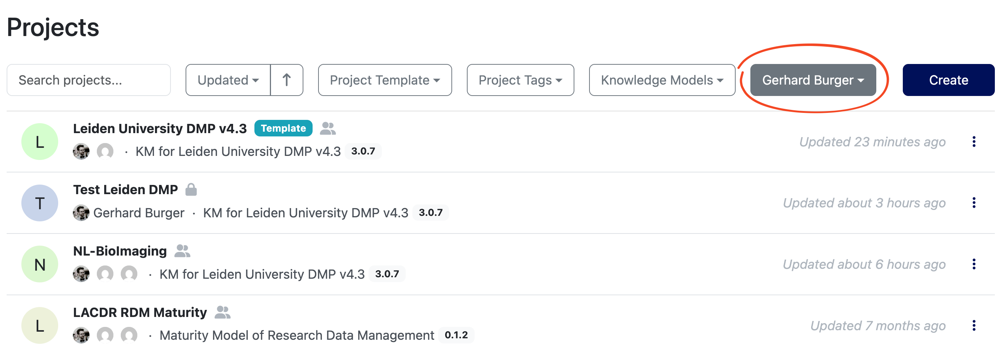
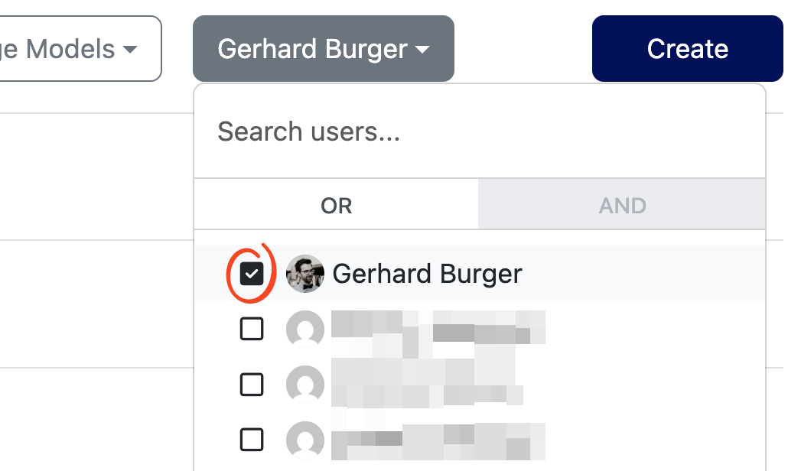

## DS Wizard Introduction

### Creating an account

If you don't already have an account for the Leiden instance of the DS Wizard (<https://leiden.ds-wizard.org/>), you will need to create one.

To create an account, go to <https://leiden.ds-wizard.org/> and click the *Sign Up* button at the top right. Fill in your details and use your Leiden University email address. 
After submitting the form, you will receive an email to verify your account. 
Once verified, you can login to the DS Wizard.

### Navigation

On first login, you will be on the Dashboard, where you will be shown the link to the Projects page where you will manage/review DMPs. 
By default the Projects page will show you all DMPs you have created or that have been shared with you. 
At first this is very likely empty. To view all accessible projects in the DS Wizard, click the button with your name:

{}
and deselect your name from the filter list:

{width=300 fig-align="center"}
