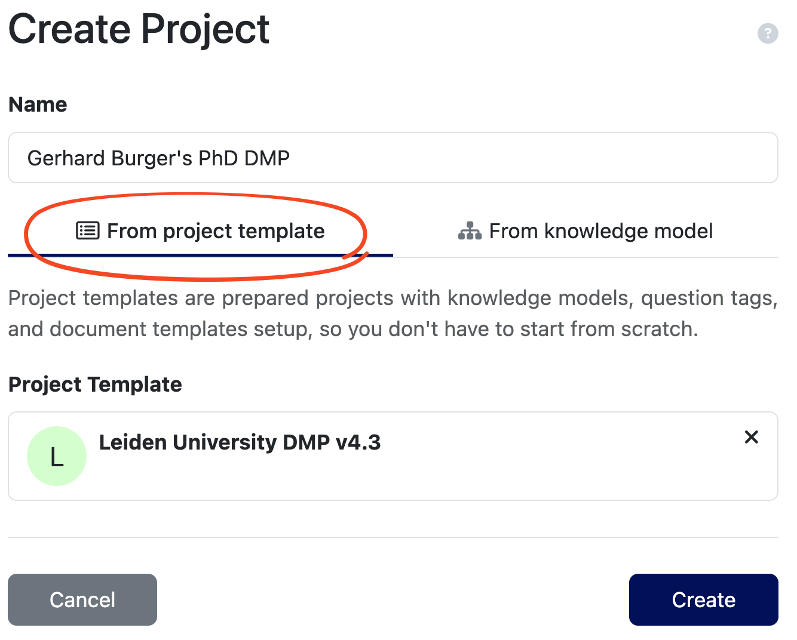
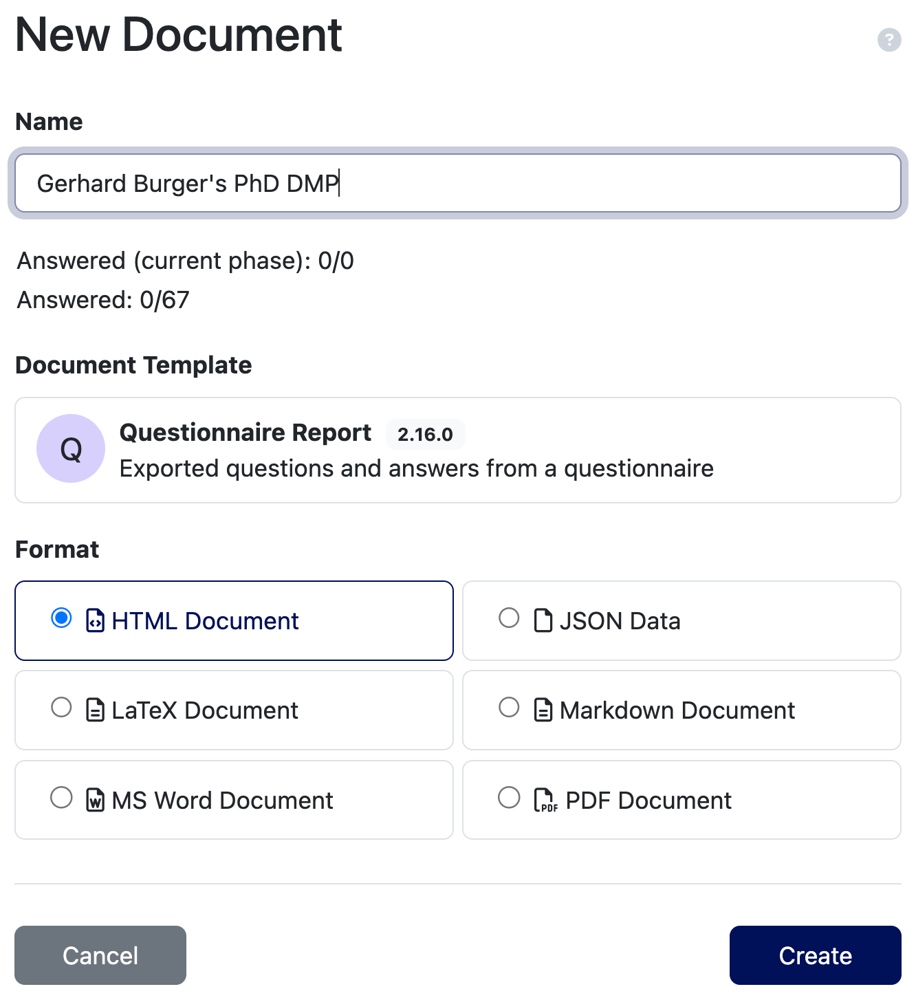



## Creating a DMP

### Creating a project

To create a new Data Management Plan (DMP) in the DS Wizard, navigate to the *Projects* page and click the *Create* button at the top right. You will see the Project Create form. 

{width=400 fig-align="center"}

Pick a *Name* that easily identifies your project, for example "Gerhard Burger's PhD DMP". Then select the *Leiden University DMP* template from the project template list.

:::{.callout-tip}
## Specialized templates
The Leiden University DMP template is a general template that should be suitable for a wide range of projects. It is possible to create derived templates from this general template by prefilling certain questions with division/research-group specific information.
:::

Finally, click "Create". Your new project will open.

### Adding collaborators/reviewers

Before starting to fill in your DMP it may be useful to add collaborators/reviewers to your project. This way, they can help create/review the DMP. To add collaborators, follow the [DSW instructions on Sharing](https://guide.ds-wizard.org/en/latest/application/projects/list/detail/sharing.html). 

:::{.callout-note}
## Data Management Course
Participants of the LACDR DM Course should add "Gerhard Burger" and "Kristina Hettne" to their DMP as *Commenter* so they can provide feedback. Your DMP will also be reviewed by a member from your research group whom you can add as *Editor*. Also add your supervisor as *Owner*. Check the table in the link above for the differences between these roles.
:::

### Filling in the DMP
You are now ready to start filling in your DMP. The Leiden University DMP template consists of several chapters, each containing a number of questions. You can view the chapters and questions on the left hand side. 

:::{.callout-note}
## Phases
You can ignore the *Phases* section at the top of the question list. This is a more advanced feature that is not implemented in the Leiden University template.
:::

While developing the DMP, there are some handy tools to help you (click the links for detailed instructions):

* [**TODOs**](https://guide.ds-wizard.org/en/latest/application/projects/list/detail/questionnaire.html#todos): Keep track of questions you don't know how to answer yet and want to come back to later. **NB:** These are not visible to Viewers/Commenters.
* [**Comments**](https://guide.ds-wizard.org/en/latest/application/projects/list/detail/questionnaire.html#comments): Ask for help from collaborators/reviewers by adding comments to questions, you can also assign these comments to specific people.
* [**Version History**](https://guide.ds-wizard.org/en/latest/application/projects/list/detail/questionnaire.html#version-history): Track changes to your DMP over time, and revert to previous versions if needed. You can also create *Named Version*s to mark important milestones in the project (e.g., annual reviews).

### Preview and Export

At any time you can preview your DMP by clicking the *Preview* tab at the top. For the Leiden University template, this will generate an HTML version of your DMP (but this can be changed in the project settings).

To export your DMP, Click the *Documents* tab at the top and select the desired format (PDF, Word, JSON, etc.).

{width=400 fig-align="center"}
